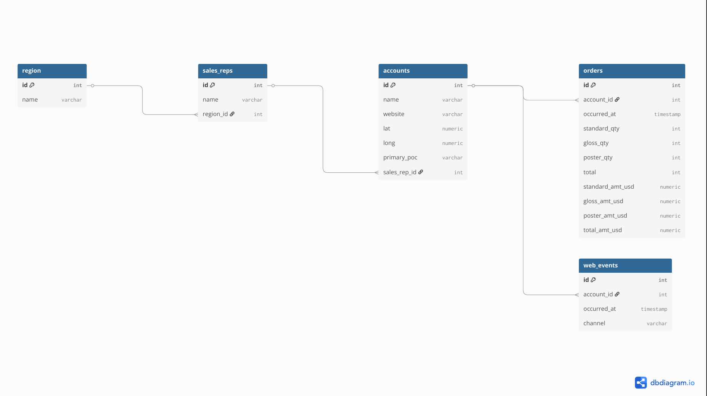

# Retail SQL Analysis — B2B Paper Sales

#### Project Artifacts (Start Here)
- SQL Answers (Q1–Q15): [docs/sql_answers.md](docs/sql_answers.md)
- ERD (PDF): [docs/erd.pdf](docs/erd.pdf)
- Data Dictionary (PDF): [docs/data_dictionary.pdf](docs/data_dictionary.pdf)
- SQL Script: [sql/retail_analysis.sql](sql/retail_analysis.sql)

---

#### 1) Background & Overview (Data Analyst POV)
This analysis translates raw retail transactions and digital activity into decision-ready metrics used by **Sales Leadership**, **Sales Operations**, **Marketing Analytics**, and **Finance**. The work answers practical Business Analyst questions: **where revenue is coming from**, **which customers are highest value**, **which regions outperform**, and **how demand behaves over time**.

The solution demonstrates core analytics SQL techniques—**JOINs**, **aggregations**, **CTEs/subqueries**, and **window functions**—to produce repeatable KPI outputs that support planning and performance reviews.

---

#### 2) Data Structure Overview (Business View)

**Database entities (scope)**
| Table | Rows | What it represents |
|---|---:|---|
| accounts | 351 | Customer accounts, assigned to a sales rep |
| orders | 6,912 | Transactions (units + USD amounts by product type) |
| sales_reps | 50 | Sales reps, assigned to a region |
| region | 4 | Region lookup (e.g., Northeast, West) |
| web_events | 9,073 | Account-level web interactions by channel |

**Date coverage (orders)**
- **First order:** 2013-12-04  
- **Last order:** 2017-01-02  

**How the tables connect (high level)**
- **Region → Sales Reps → Accounts → Orders**
- **Accounts → Web Events**

(See: [ERD](docs/erd.pdf) and [Data Dictionary](docs/data_dictionary.pdf).)

---

#### 3) Executive Summary
Across **6,912 orders (2013–2017)**, **Standard** paper is the largest revenue driver at **$9.67M**, ahead of **Gloss ($7.59M)** and **Poster ($5.88M)**—making product mix the primary lever for revenue planning. The **Northeast** generates the highest total sales (**$7.74M**), while **West** and **Midwest** post **above-average order values** (**$3,626** and **$3,360** vs. company average **$3,348**), suggesting different regional growth playbooks. **Direct** is the largest web channel by activity (**5,298 events**) and shows the strongest association with sales volume in account-level joins; however, attribution is not order-level and should not be used alone for budget decisions.

Full technical details and reproducible outputs are available in [SQL Answers](docs/sql_answers.md) and the [SQL Script](sql/retail_analysis.sql).

---

#### 4) Insights Deep Dive

##### Insight 1 — Product mix: Standard is the primary revenue driver
- **Business Metrics:** Product revenue by paper type (USD)
- **Evidence (2013–2017):** Standard generated **$9.67M** in revenue, higher than Gloss (**$7.59M**) and Poster (**$5.88M**).
- **So What:** Standard demand is the main input for revenue planning. Forecasting and basic product strategy should start with Standard, then use targeted cross-sell to grow Gloss and Poster where it fits.
- **Who uses this:** Sales Leadership, Sales Operations, Finance, Operations/Supply.

##### Insight 2 — Region: Northeast leads total revenue; West/Midwest lead AOV (Average Order Value)
- **Business Metrics:** Total revenue by region; **AOV (Average Order Value)** proxy = `AVG(total_amt_usd)`
- **Evidence:** Northeast leads total sales at **$7.74M**. West (**$3,626**) and Midwest (**$3,360**) are above the company AOV (**$3,348**).
- **So What:** One regional plan will not fit all. Northeast performance looks more volume-driven, while West and Midwest skew toward larger orders. This supports region-specific targets and coaching focus.
- **Who uses this:** Regional Sales Leaders, Sales Operations, Finance.

##### Insight 3 — Top accounts: Highest AOV customers (benchmark for account planning)
- **Business Metrics:** Account-level **AOV (Average Order Value)**  calculated as the average of total_amt_usd
- **Evidence (Top 5 by AOV):** Pacific Life (**$19,639.94**), Fidelity National Financial (**$13,753.41**), Kohl's (**$12,872.17**), State Farm Insurance Cos. (**$12,423.39**), AmerisourceBergen (**$9,685.45**).
- **So What:** This list helps Sales and Sales Operations prioritize account plans. It separates consistently large-basket customers from accounts that may buy more often but in smaller orders.
- **Who uses this:** Account Managers/Sales, Sales Operations, Finance.

---

#### 5) Recommendations (Next Steps)

- **Focus on the main revenue product (Standard).**  
  **Why:** Standard brings in the most revenue (**$9.67M**), higher than Gloss and Poster.  
  **Next step:** Make Standard the default baseline for forecasting and basic planning discussions, then review if Gloss/Poster growth opportunities exist by customer segment.  
  **Expected impact:** More realistic plans and fewer surprises in demand and supply planning.

- **Use different regional approaches (volume vs. order size).**  
  **Why:** The **Northeast** leads total revenue (**$7.74M**), while **West/Midwest** have higher **Average Order Value (AOV)** than the company average.  
  **Next step:** For Northeast, prioritize retention and repeat ordering (keep high-volume customers engaged). For West/Midwest, focus on increasing deal size and expanding existing accounts.  
  **Expected impact:** Targets and sales activities match the way each region performs.

- **Treat web channel findings as a signal, not a final answer.**  
  **Why:** “Direct” has the most web events (**5,298**), but web events are connected to orders only at the account level, not at the order/session level.  
  **Next step:** Before making marketing budget decisions, agree on a simple rule for linking web activity to sales (for example, time-window matching), or collect data that ties events to orders.  
  **Expected impact:** Better confidence in marketing reporting and fewer misleading conclusions.

- **Create a simple recurring performance update (one page).**  
  **Why:** Monthly totals and trend views help track pacing and highlight spikes early.  
  **Next step:** Share a monthly revenue snapshot and a weekly order-trend view with Sales and Finance in a consistent format.  
  **Expected impact:** Faster alignment in meetings and quicker responses to changes in demand.

---

#### Caveats & Assumptions
- **Web channel attribution is limited.**  
  **Why:** Web events are linked to sales only through `account_id`. The data does not connect a specific web visit to a specific order.  
  **What it affects:** Channel comparisons (for example, “Direct drives more sales”) can be overstated for accounts that are simply very active online.

- **“Most profitable” is treated as highest revenue, not true profit.**  
  **Why:** The dataset includes revenue fields, but it does not include costs, discounts, or COGS.  
  **What it affects:** Any “profitability” conclusion should be read as “highest revenue,” and Finance would need cost data to confirm margin.
